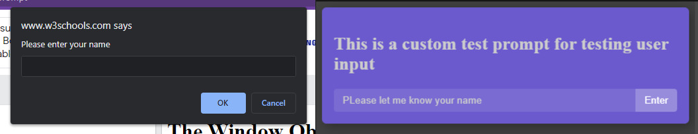

# reactprompt

Use React components as prompt() function without managing their state in the parent component. Please, firstly, check the [demo on codesandbox](https://codesandbox.io/s/sleepy-christian-drsdk2)

```javascript
// Window prompt
const userInp = prompt("Enter your username");

// React prompt
const userInp2 = await openModal({
  title: "This is a custom test prompt for testing user input",
  placeholder: "Enter your name",
});
```



## Create a custom test prompt

Create a custom prompt like the one below. This component must accept `onClose` function as prop and it should be called when you want to close the prompt

```javascript
// Modal.js
import { useRef } from "react";

const Modal = (props) => {
  const inp = useRef(null);

  const onClose = () => {
    props.onClose(inp.current.value);
  };

  return (
    <>
      <div className="modal-background"></div>
      <div className="modal">
        <h2>{props.title}</h2>
        <div className="flex">
          <input
            ref={inp}
            className="modal-inp"
            type="text"
            placeholder={props.placeholder}
          />
          <button
            className="modal-btn"
            onClick={() => onClose("from component")}
          >
            Enter
          </button>
        </div>
      </div>
    </>
  );
};

export default Modal;
```

### Create reusable function to show the prompt

```javascript
// openModal.js
import reactprompt from "./reactpromt"; // this file is included in this project
import Modal from "./modal";

const openModal = async (props) => {
  return await reactprompt(Modal, props);
};

export default openModal;
```

### Use the prompt in a component

```javascript
// App.js
export default function App() {
  const [name, setName] = useState("");
  const getUserInput = async () => {
    const newName = await openModal({
      title: "This is a custom test prompt for testing user input",
      placeholder: "PLease let me know your name",
    });
    setName(newName);
  };

  return (
    <div className="App">
    {/* code */}
      <button onClick={getUserInput}>
        Enter your name
      </button>
    {/* code */}
    </div>
  );
}
```
